# 📱 Lista de Tarefas

[](https://flutter.dev/)
[](https://dart.dev/)
[](https://developer.android.com/)
[](https://developer.apple.com/ios/)

Um aplicativo móvel elegante e intuitivo para gerenciamento de tarefas pessoais, desenvolvido com Flutter. Este projeto foi criado como parte da disciplina **Desenvolvimento Mobile com Flutter [26E2_2]**.

## ✨ Funcionalidades

- **📝 Criar Tarefas**: Adicione novas tarefas com nome, data e hora programada
- **📍 Localização Integrada**: Associe tarefas a locais específicos usando GPS e geocodificação
- **🗓️ Agendamento**: Defina datas e horários para suas tarefas
- **📱 Interface Responsiva**: Design moderno e adaptável para diferentes tamanhos de tela
- **🗑️ Gerenciamento Completo**: Visualize, edite e exclua tarefas facilmente
- **📊 Detalhes Completos**: Veja informações detalhadas de cada tarefa, incluindo localização formatada

## 🛠️ Tecnologias Utilizadas

- **Framework**: Flutter
- **Linguagem**: Dart
- **Localização**: Geolocator + Geocoding
- **Internacionalização**: Flutter Localizations + Intl
- **Arquitetura**: Clean Architecture (Domain-Driven Design)
- **Gerenciamento de Estado**: Stateful Widgets

### Dependências Principais

- `geolocator: ^14.0.2` - Para obter localização GPS
- `geocoding: ^4.0.0` - Para converter coordenadas em endereços
- `intl: ^0.20.2` - Para formatação de datas e internacionalização

## 📋 Pré-requisitos

Antes de começar, certifique-se de ter instalado:

- [Flutter SDK](https://flutter.dev/docs/get-started/install) (versão 3.11.1 ou superior)
- [Dart SDK](https://dart.dev/get-dart) (incluído no Flutter)
- Um editor de código como [Visual Studio Code](https://code.visualstudio.com/) ou [Android Studio](https://developer.android.com/studio)
- Dispositivo físico ou emulador para testes

### Verificar Instalação

```bash
flutter doctor
```

## 🚀 Instalação e Execução

1. **Clone o repositório**:

   ```bash
   git clone https://github.com/BrenoLeiriaoNeto/lista_de_tarefas.git
   cd lista-de-tarefas
   ```

2. **Instale as dependências**:

   ```bash
   flutter pub get
   ```

3. **Execute o aplicativo**:
   ```bash
   flutter run
   ```

### Plataformas Suportadas

O aplicativo pode ser executado em:

- **📱 Android**: `flutter run` (dispositivo/emulador Android)
- **🍎 iOS**: `flutter run` (dispositivo/simulador iOS, apenas macOS)
- **🖥️ Desktop**:
  - Linux: `flutter run -d linux`
  - macOS: `flutter run -d macos`
  - Windows: `flutter run -d windows`
- **🌐 Web**: `flutter run -d chrome`

## 📖 Como Usar

### Criando uma Nova Tarefa

1. Toque no botão **+** (flutuante) na tela principal
2. Preencha o **nome da tarefa**
3. Selecione a **data e hora** desejada
4. Toque em **"Localização"** para usar sua posição atual (requer permissão de GPS)
5. Toque em **"Salvar"**

### Gerenciando Tarefas Existentes

- **Visualizar**: Toque em qualquer tarefa da lista para ver detalhes
- **Editar**: Na tela de detalhes, toque em "Editar" para modificar
- **Excluir**: Deslize a tarefa para a esquerda ou use o botão de exclusão

### Permissões Necessárias

O aplicativo solicita as seguintes permissões:

- **Localização**: Para associar tarefas a locais específicos
- **Armazenamento**: Para salvar dados temporariamente (atual implementação usa memória)

## 🧭 Passo a Passo

Siga os passos abaixo para entender a navegação do app. Substitua as imagens de exemplo pelos seus próprios prints.

1. **Tela inicial**
   - Descrição: Exibe a lista de tarefas atuais e o botão para adicionar nova tarefa.

   <p align="center">
      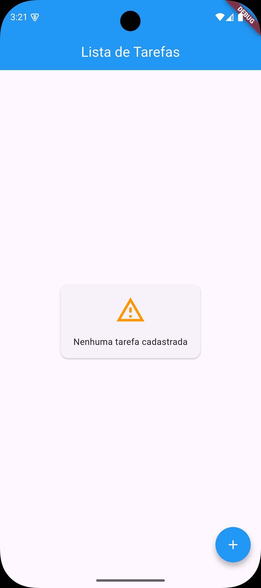
   </p>

   ***

2. **Adicionar nova tarefa**
   - Descrição: Ao pressionar o botão do canto inferior direito, seremos levados a tela de cadastro de uma nova tarefa. Podemos então preencher os campos e pressionar o botão "Salvar". Isso nos levará devolta a tela inicial, agora com a nova tarefa criada sendo listada.

   <p align="center">
      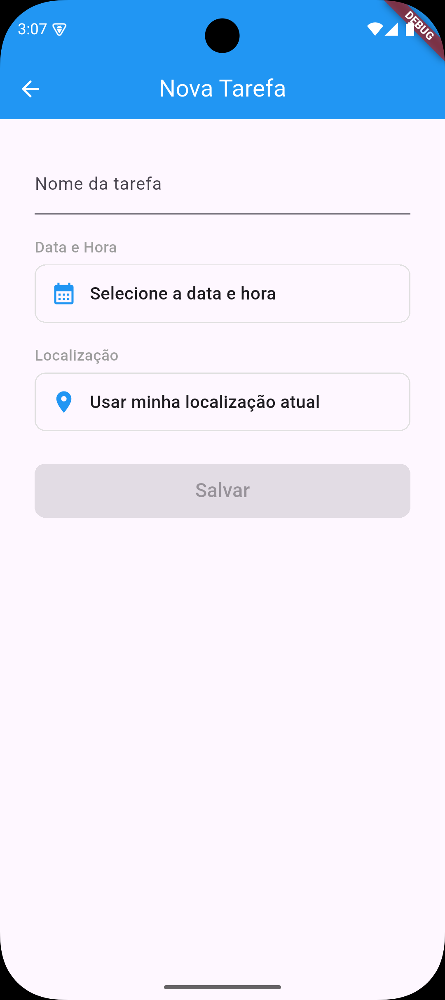&nbsp;&nbsp;&nbsp;&nbsp;
      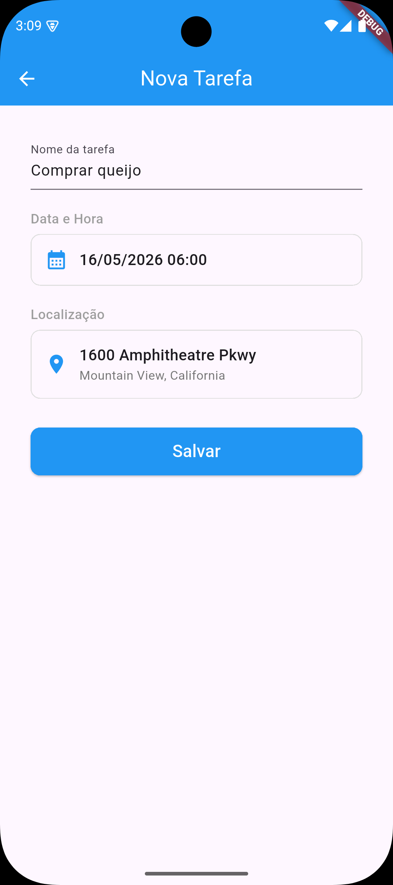&nbsp;&nbsp;&nbsp;&nbsp;
      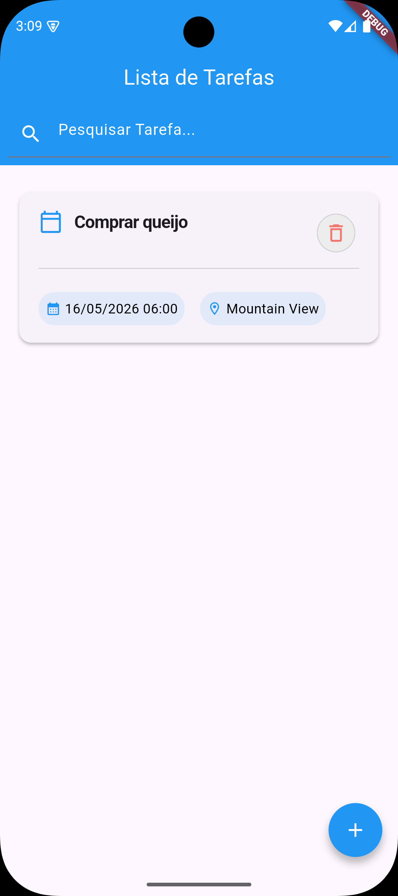
   </p>

   ***

3. **Detalhes da tarefa**
   - Descrição: Ao pressionar no card da tarefa, na tela de listagem de tarefas, somos levados a tela de detalhamento da tarefa, contendo informações completas da tarefa selecionada, incluindo localização e opções de edição e exclusão.

   <p align="center">
      &nbsp;&nbsp;&nbsp;&nbsp;
      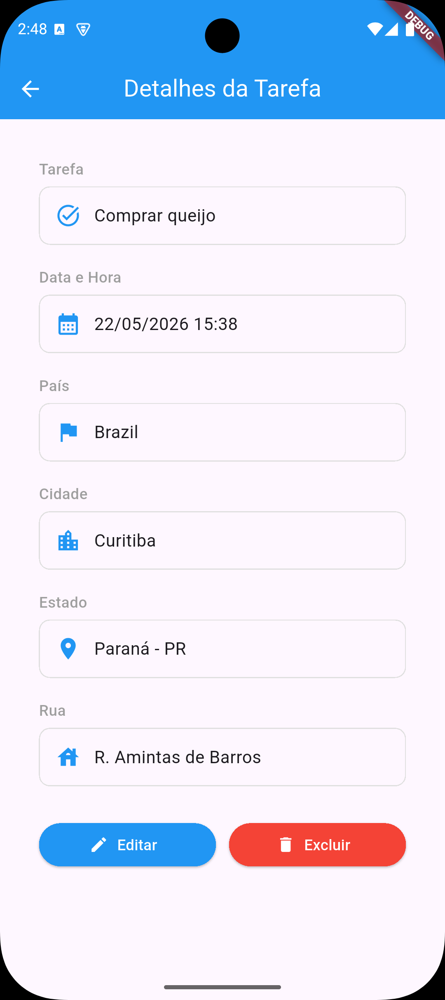
   </p>

   ***

4. **Edição de tarefa**
   - Descrição: Ainda na tela de detalhamento da tarefa, pressione o botão "Editar". Seremos levados a tela de edição da tarefa selecionada. Alteramos os campos desejados e pressionamos o botão "Salvar alterações" e então somos levados a tela de listagem de tarefas, agora com a tarefa contendo as informações atualizadas.

   <p align="center">
      &nbsp;&nbsp;&nbsp;&nbsp;
      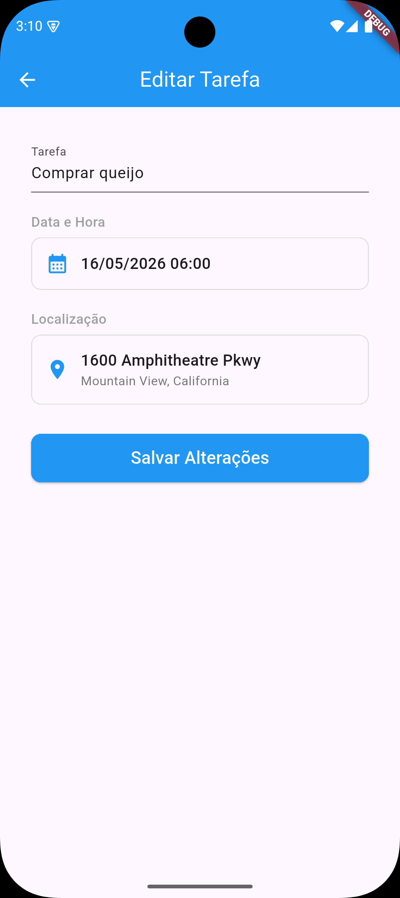&nbsp;&nbsp;&nbsp;&nbsp;
      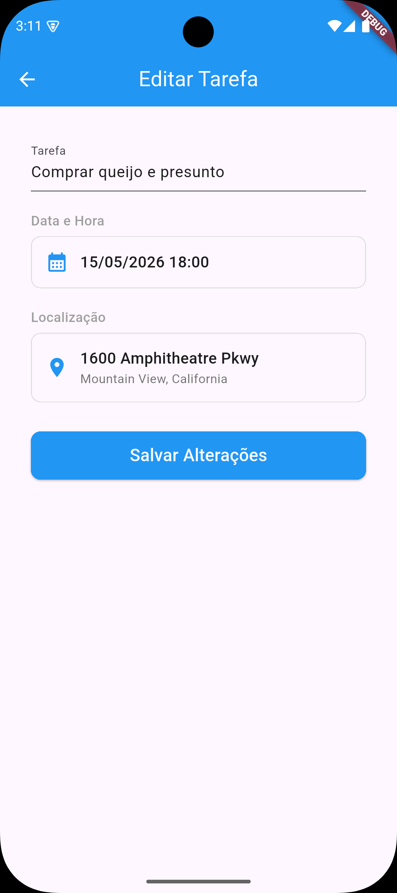
      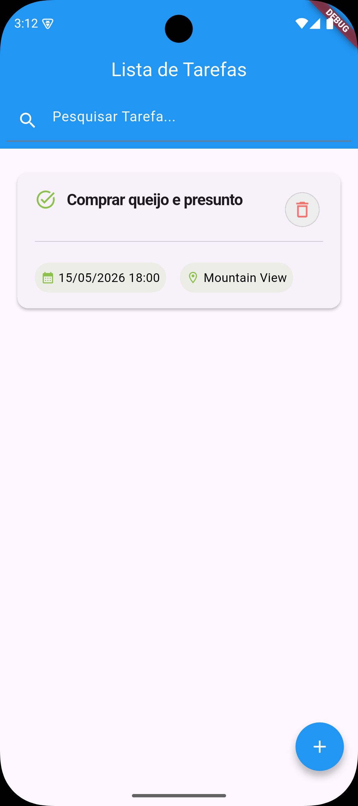
   </p>

   ***

5. **Listagem e pesquisa de tarefas**
   - Descrição: Após criarmos mais algumas tarefas, a tela de listagem de tarefas ira ser preenchida com as novas adições. Se olharmos para o topo da tela de listagem, veremos um campo onde nos e permitido fazer a pesquisa de tarefas pelo título delas. Vamos pesquisar a tarefa "Fazer trabalho de flutter e dart", apenas passando algum conteudo existente no título da tarefa.

   <p align="center">
      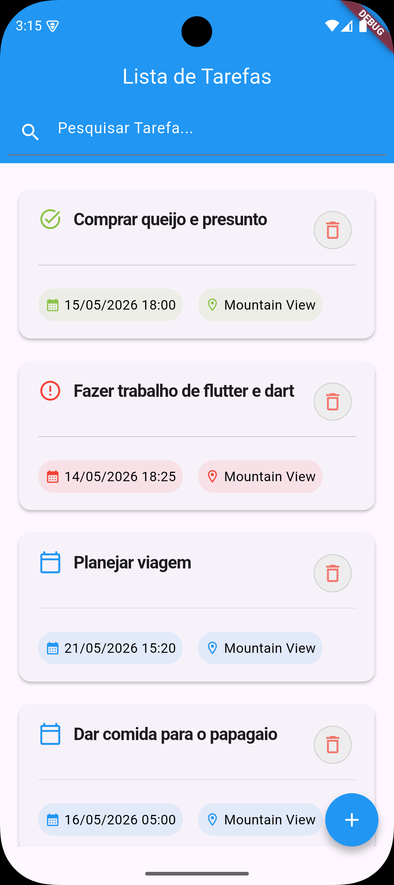&nbsp;&nbsp;&nbsp;&nbsp;
      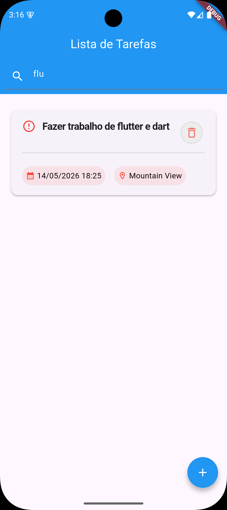
   </p>

   ***

6. **Excluir tarefa**
   - Descrição: Para excluir uma tarefa, basta pressionar o icone de lixeira presente no card da tarefa que deseja excluir e confirmar a exclusão. Esta funcionalidade tambem esta presente na tela de detalhamento de tarefa, onde o botão "Excluir" possui o mesmo efeito. Aqui, foi excluida a tarefa "Fazer trabalho de flutter e dart" através da tela de listagem e a tarefa "Planejar viagem", através da tela de detalhamento da tarefa.

   <p align="center">
      &nbsp;&nbsp;&nbsp;&nbsp;
      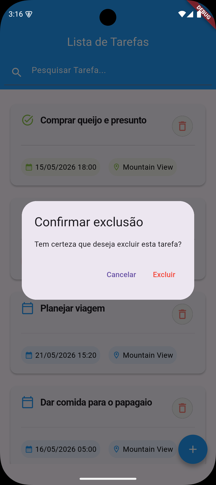&nbsp;&nbsp;&nbsp;&nbsp;
      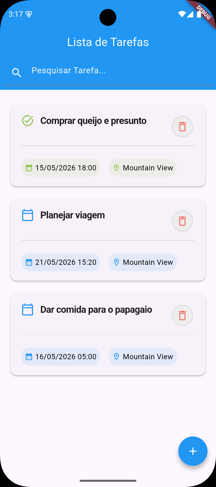
      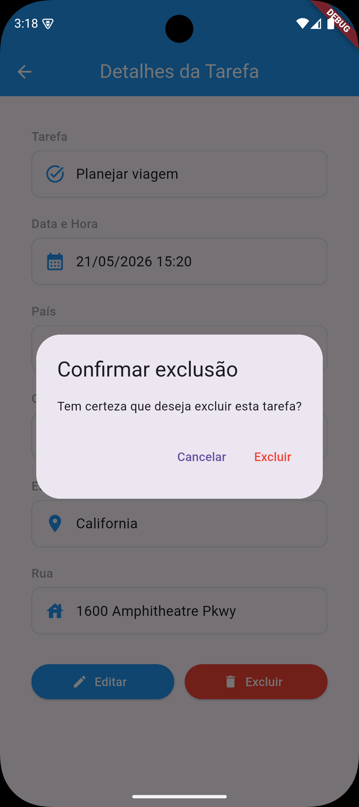&nbsp;&nbsp;&nbsp;&nbsp;
      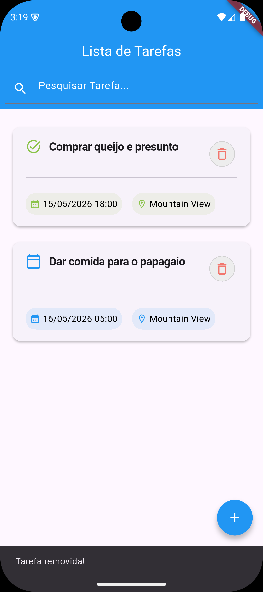
   </p>

   ***

## 🏗️ Estrutura do Projeto

```
lib/
├── app.dart                    # Configuração principal do app
├── main.dart                   # Ponto de entrada
├── core/                       # Componentes compartilhados
│   ├── router/                 # Roteamento do app
│   ├── services/               # Serviços utilitários
│   │   ├── location_service.dart    # Serviço de localização
│   │   └── brazil_date_format.dart  # Formatação de datas BR
│   └── widgets/                # Widgets reutilizáveis
├── features/                   # Funcionalidades do app
│   └── tasks/                  # Módulo de tarefas
│       ├── data/               # Camada de dados
│       │   ├── task_repository.dart  # Repositório de tarefas
│       │   └── task_storage.dart     # Armazenamento (memória)
│       ├── domain/             # Camada de domínio
│       │   ├── task.dart            # Modelo Task
│       │   └── geo_location.dart    # Modelo GeoLocation
│       └── presentation/       # Camada de apresentação
│           ├── helpers/        # Utilitários de UI
│           ├── pages/          # Páginas/screens
│           └── widgets/        # Widgets específicos
```

### Arquitetura

O projeto segue os princípios da **Clean Architecture**:

- **Domain**: Regras de negócio e modelos de dados
- **Data**: Acesso a dados e repositórios
- **Presentation**: Interface do usuário e controladores

## 🧪 Testes

Execute os testes incluídos:

```bash
flutter test
```

## 📦 Build e Distribuição

### Android APK

```bash
flutter build apk --release
```

### iOS (apenas macOS)

```bash
flutter build ios --release
```

### Web

```bash
flutter build web --release
```

## 📄 Licença

Este projeto é parte de um trabalho acadêmico e não possui licença específica para distribuição comercial. Use para fins educacionais.

## 👨‍💻 Autor

**Breno Leiria Neto** - Desenvolvimento Mobile com Flutter [26E2_2]

---

_Desenvolvido com ❤️ usando Flutter_
